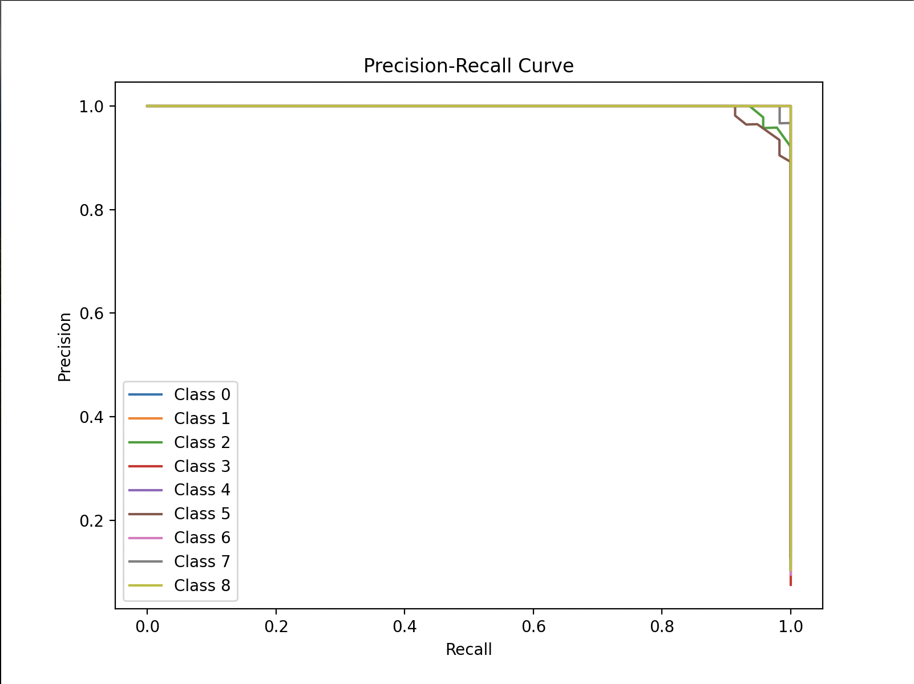
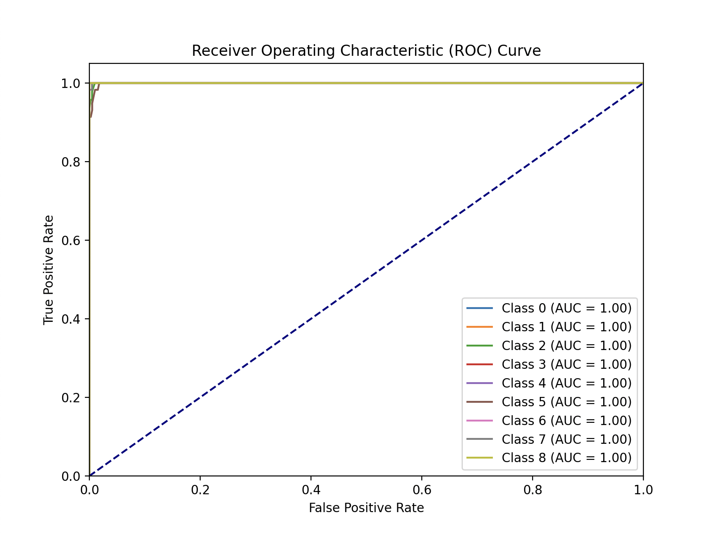
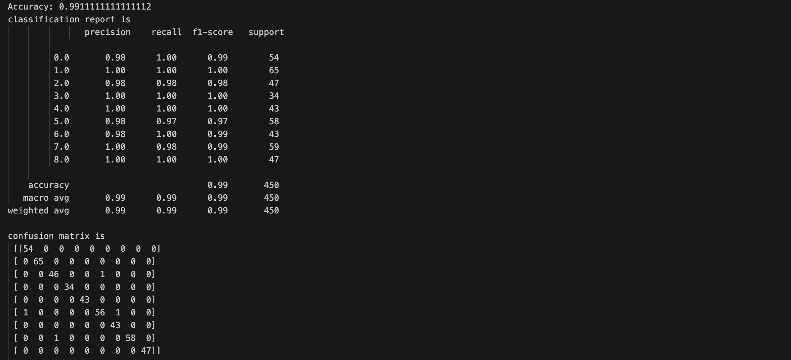
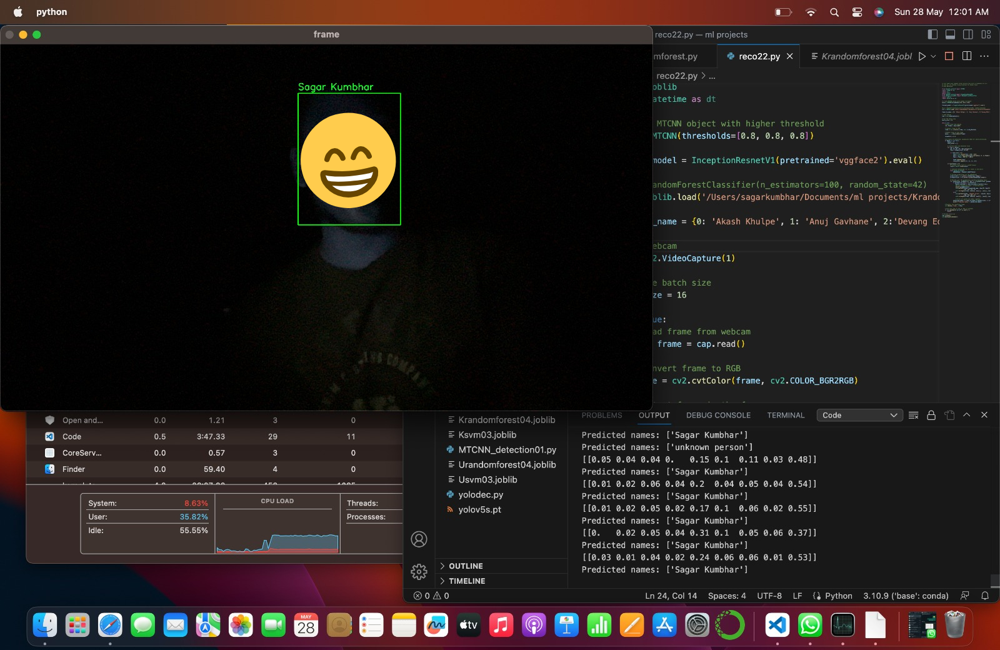

<h1> Attendance marking system </h1>

  This repository is an application of high performance face recognition using FaceNet, 
  Multi-Task Cascaded Convolutional Neural Networks(MTCNN) and Random Forest classifier.
  A camera is used to capture video frames and each frame is analysed by the face recogonition algorithm, 
  if a face is recognized name of the person is displayed in the console with confidence score. 
  Names displayed in console are also displayed in a excel sheet within Names column along with date and in-time(shows the students' arrival time in class).

<h2> 
  <b> Requirements </b> 
</h2>

<list> 
<ol>
  <li> Camera </li>
  <li> Python (latest version preffered) </li>
  <li>Libraries
  <ul>
    <li> pytorch - provides machine learning framework. </li>
    <li> facenet-pytorch - provides implementation of FaceNet and uses PyTorch framework. </li>
    <li> sklearn - contains tools and utilities for data preparation, model fitting, and evaluation. </li>
    <li> opencv - provides methods to read images and video frames from camera. </li>
    <li> joblib - provides a set of tools to for lightweight pipelining and loading model. </li>
  </ul>
  </li>
</ol>
</list>

<h2> Steps to run the program </h2>
<list> 
<ol>
  <li> Clone the repository or download the zip file. </li>
  <li> Collect images of people and create a dataset. </li>
  <li> Download FaceNet model and generate embeddings of images present in the dataset. </li>
  <li> Train your classification model on the generated embeddings using the train.py script. </li>
  <li> Open the main.py file and update model address. </li>
  <li> Run the program. </li>
</ol>
</list>

<h2> Results </h2>
<list>
<ol>
<li> The trained clasiffication model has an accuracy score of 99 % </li>
<li> Model demonstrated remarkable recognition ability in low light conditions, </li>
<li> The model excels at recognizing faces from various angles, positions, and even from a distance of 7 meters.</li>
</ol>
</list>

<h3> Precision recall curve </h3>

<h3> Receiver operating characteristic curve </h3>

<h3> Accuracy & Confusion matrix </h3>

<h3> Low light performance </h3>

<h2> Observations </h2>

As the pixel count increases, we get better video quality so the camera can capture more information or detailing in every frame and range of the camera increases as well, but the CPU/GPU now has to evaluate so many pixels in the frame. The algorithm can perform even better(recogonise faces from a distance of 10 meters) if used with a better processor

